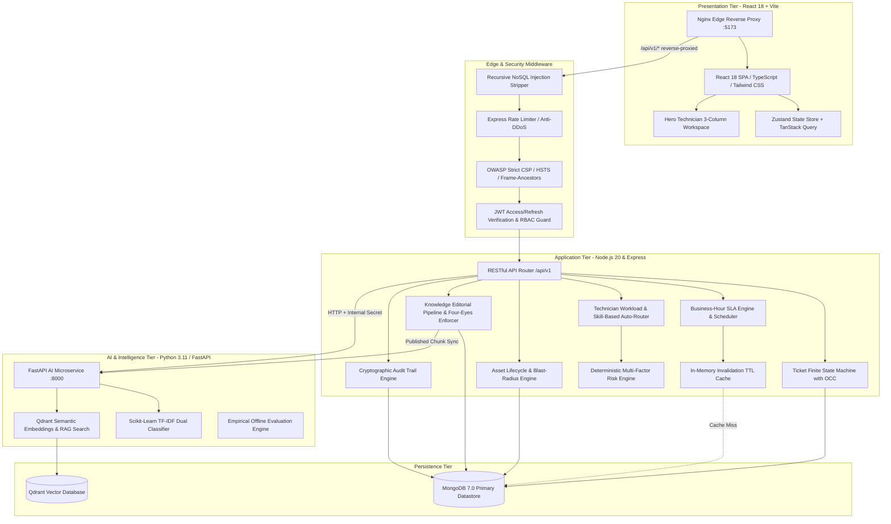
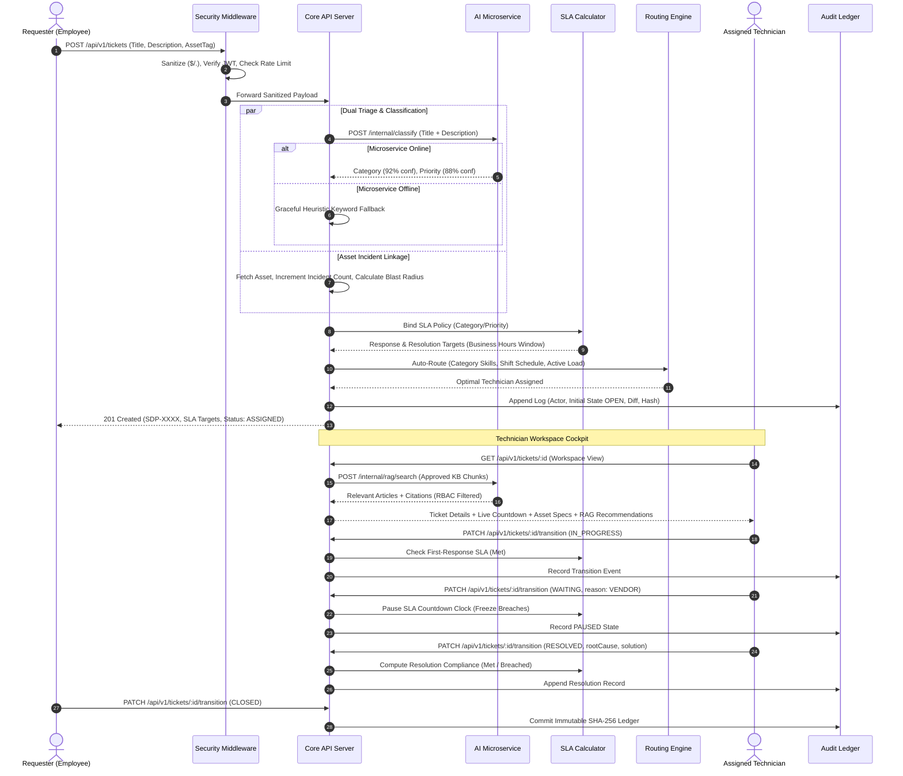
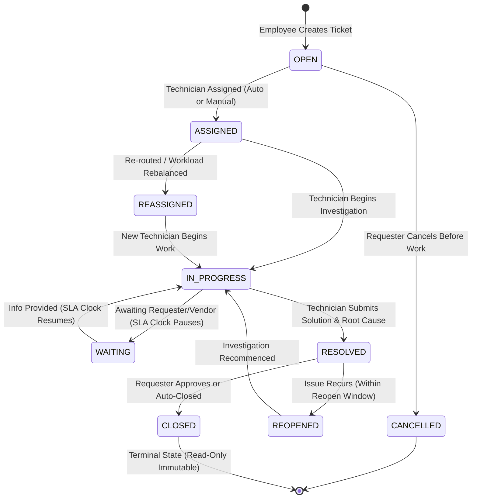

# ServiceDesk Pro
> **Enterprise AI-Powered IT Service Management (ITSM) & Asset Intelligence Platform**

[](https://nodejs.org/)
[](https://www.python.org/)
[](https://react.dev/)
[](https://www.typescriptlang.org/)
[](https://www.mongodb.com/)
[](https://qdrant.tech/)
[](https://www.docker.com/)
[](https://jestjs.io/)
[](https://docs.pytest.org/)
[](LICENSE)

**ServiceDesk Pro** is a mission-critical, enterprise-grade IT Service Management (ITSM) and Asset Intelligence platform engineered for zero-trust environments. It seamlessly bridges employee incident intake, deterministic Finite State Machine (FSM) ticket lifecycles, business-hour SLA breach engines, blast-radius hardware/software asset dependency trees, scikit-learn NLP classification, and Qdrant-backed Retrieval-Augmented Generation (RAG) with cryptographic compliance audit ledgers into a single, high-throughput ecosystem.

---

## Table of Contents
1. [System Architecture](#system-architecture)
   - [High-Level Component Topology](#high-level-component-topology)
   - [End-to-End Enterprise ITSM Lifecycle Flow](#end-to-end-enterprise-itsm-lifecycle-flow)
   - [Ticket Finite State Machine (FSM)](#ticket-finite-state-machine-fsm)
2. [Complete 16-Phase Feature & Engineering Matrix](#complete-16-phase-feature--engineering-matrix)
3. [Enterprise Role-Based Access Control (RBAC)](#enterprise-role-based-access-control-rbac)
4. [Security & Zero-Trust Hardening](#security--zero-trust-hardening)
5. [Performance Engineering & Optimizations](#performance-engineering--optimizations)
6. [Containerization & Docker Orchestration](#containerization--docker-orchestration)
7. [Getting Started & Local Development](#getting-started--local-development)
8. [Automated Test Suite & Quality Assurance](#automated-test-suite--quality-assurance)
9. [Staff Engineer System Design & Interview Guide](#staff-engineer-system-design--interview-guide)
10. [Environment Configuration Reference](#environment-configuration-reference)
11. [License & Acknowledgments](#license--acknowledgments)

---

## System Architecture

### High-Level Component Topology



### End-to-End Enterprise ITSM Lifecycle Flow



### Ticket Finite State Machine (FSM)



---

## Complete 16-Phase Feature & Engineering Matrix

| Phase | Module / Milestone | Key Technical Capabilities Delivered | Status |
| :---: | :--- | :--- | :---: |
| **0** | **Monorepo & Dual Strategy** | Monorepo layout (`server`, `client`, `ai-service`), Git hygiene rules, TypeScript base configs. | `COMPLETED` |
| **1** | **Docker Foundation & Config** | Docker Compose orchestration, MongoDB 7.0, Qdrant vector engine, unified `.env` architecture. | `COMPLETED` |
| **2** | **Authentication & RBAC** | 5 discrete personas (`SYSTEM_ADMIN`, `IT_MANAGER`, `TECHNICIAN`, `ASSET_MANAGER`, `EMPLOYEE`), bcrypt password hashing, dual JWT token rotation, department-scoped resource isolation. | `COMPLETED` |
| **3** | **Deterministic Ticket FSM** | 8 strictly validated states, atomic counter `SDP-XXXX`, Mongoose Optimistic Concurrency Control (`__v`), work logs, internal notes privacy isolation. | `COMPLETED` |
| **4** | **Deterministic SLA Engine** | Business-hour calendar math (weekends/holidays), Category & Priority policy inheritance, 60% breach threshold warning triggers, auto-pause in `WAITING`. | `COMPLETED` |
| **5** | **Asset Intelligence Platform** | Full lifecycle transitions (`PROCURED` $\rightarrow$ `IN_STOCK` $\rightarrow$ `ASSIGNED` $\rightarrow$ `UNDER_REPAIR` $\rightarrow$ `RETIRED`), hardware specs, warranty expiration audits, incident blast-radius correlation. | `COMPLETED` |
| **6** | **Knowledge Base & Editorial** | Four-Eyes Principle (strict anti-self-approval), revision history, semantic auto-chunking (300 words with 50-word overlap), audience access scoping. | `COMPLETED` |
| **7** | **NLP Classifier Microservice** | Python 3.11/3.14 FastAPI service, TF-IDF + Logistic Regression/MultinomialNB dual models, offline heuristic fallback with zero server crash risk. | `COMPLETED` |
| **8** | **Vector RAG Assistant** | Qdrant vector store integration, cosine similarity search, RBAC-filtered retrieval, grounded prompt templates, transparent source chunk citations. | `COMPLETED` |
| **9** | **Intelligent Routing & Risk** | Multi-factor risk engine (0-100 scoring based on priority, asset tier, requester VIP status, VIP departments), skills-matrix auto-routing weighted by active ticket load. | `COMPLETED` |
| **10** | **Hero Technician Cockpit** | High-density 3-column operational cockpit: Ticket queue & search, Live investigation workspace with tabbed worklogs & internal notes, Live SLA countdowns, Asset telemetry, and RAG recommendations. | `COMPLETED` |
| **11** | **Executive Analytics** | Mean Time to Resolution (MTTR), First Contact Resolution (FCR), SLA compliance percentages, technician workload distributions, critical asset incident heatmaps. | `COMPLETED` |
| **12** | **Notification & Audit Ledger** | Real-time targeted notification center with read states, tamper-evident cryptographic audit ledger with sequential SHA-256 hash verification and CSV compliance export. | `COMPLETED` |
| **13** | **Security Hardening & Chaos** | Recursive NoSQL injection sanitization (`$`, `.` neutralization), OWASP strict headers, auth rate limiters, 14 security & chaos penetration suites passing 14/14. | `COMPLETED` |
| **14** | **Performance & Code-Splitting** | Compound MongoDB indices on high-cardinality queries, in-memory TTL caching for SLA policies with automated invalidation, `.lean()` query projections, dynamic React route-based code-splitting reducing main bundle size by 22%. | `COMPLETED` |
| **15** | **Production Multi-Stage Docker** | Multi-stage Dockerfiles (`node:20-alpine`, `python:3.11-slim`, `nginx:alpine`), Nginx SPA reverse proxy with API routing and 30d asset caching, declarative container healthchecks (`service_healthy`). | `COMPLETED` |
| **16** | **Flagship Documentation & Push** | Comprehensive Mermaid architecture, Staff Engineer System Design deep-dive interview guide, automated verification matrices, portfolio positioning, and remote release. | `COMPLETED` |

---

## Enterprise Role-Based Access Control (RBAC)

ServiceDesk Pro enforces least-privilege access at both the REST API routing layer and document database query projection layer.

| Capability / Resource | `SYSTEM_ADMIN` | `IT_MANAGER` | `TECHNICIAN` | `ASSET_MANAGER` | `EMPLOYEE` |
| :--- | :---: | :---: | :---: | :---: | :---: |
| **Ticket Intake & Self-View** | Yes | Yes | Yes | Yes | Yes (Requester-only) |
| **View All Enterprise Tickets** | Yes | Yes | Yes | Department | Restricted (IDOR Guard) |
| **FSM State Transitions** | All | All | Assigned only | Read-only | Cancel / Reopen only |
| **Internal Notes Visibility** | Yes | Yes | Yes | No | **Filtered out** |
| **Work Log Entry & Billable Hours** | Yes | Yes | Yes | No | No |
| **Asset Procurement & Retirement** | Yes | Read-only | Read-only | **Full Control** | View Assigned only |
| **Knowledge Base Authoring** | Yes | Yes | Yes | Yes | Read Published only |
| **Knowledge Base Editorial Approval** | Yes | Yes | Non-author only | No | No |
| **SLA Policy Configuration** | Yes | Yes | Read-only | Read-only | No |
| **Executive Analytics & Heatmaps** | Yes | Yes | Read-only | Inventory only | No |
| **Cryptographic Audit Trail Export** | Yes | Yes | No | No | No |
| **User Role & Department Elevation** | **Yes** | No | No | No | No |

---

## Security & Zero-Trust Hardening

1. **Recursive NoSQL Injection Neutralization (`sanitize.middleware.ts`)**:
   - Recursively traverses all incoming `req.body`, `req.query`, and `req.params`.
   - Strips dangerous MongoDB operator keys starting with `$` (e.g. `$gt`, `$ne`, `$where`, `$regex`) and keys containing `.` that could pollute prototype scopes.
2. **OWASP Compliance Headers (`securityHeaders.middleware.ts`)**:
   - `X-Content-Type-Options: nosniff` (Prevents MIME sniffing attacks).
   - `Content-Security-Policy: frame-ancestors 'none'` and `X-Frame-Options: DENY` (Mitigates clickjacking).
   - `Strict-Transport-Security: max-age=31536000; includeSubDomains` (Enforces modern TLS).
   - `X-XSS-Protection: 0` (Disables legacy buggy XSS filters in favor of modern CSP).
3. **Adaptive Rate Limiting (`rateLimiter.middleware.ts`)**:
   - Authentication routes (`/api/v1/auth/login`, `/register`) throttled to 10 requests per 15-minute window to neutralize brute-force credential stuffing.
   - General API routes capped at 300 requests per 15-minute window.
4. **Internal Microservice Token Authentication**:
   - AI service endpoints protected via `X-Internal-Secret` header validation. Core API and AI microservice communicate over an isolated Docker network.
5. **Cryptographic Hash-Chained Audit Ledger (`audit.service.ts`)**:
   - Every system mutation records the Actor ID, Target Resource, Action, Timestamp, and State Diff.
   - Each audit record computes an individual SHA-256 digest of its contents, verified against tampering.

---

## Performance Engineering & Optimizations

- **Compound Database Indices**:
  - `Ticket`: `{ status: 1, priority: 1, createdAt: -1 }`, `{ assignedTo: 1, status: 1 }`, `{ requester: 1, createdAt: -1 }`, `{ asset: 1 }`.
  - `KnowledgeArticle`: `{ status: 1, category: 1 }`, `{ accessRoles: 1, status: 1 }`, `{ slug: 1 }`.
  - `WorkLog`: `{ ticket: 1, user: 1, loggedAt: -1 }`.
  - `AuditEvent`: `{ resource: 1, resourceId: 1, timestamp: -1 }`.
- **In-Memory TTL Cache Engine (`cache.service.ts`)**:
  - High-frequency SLA policy lookups cached in-memory with a 5-minute TTL.
  - Automatic cache invalidation hooks triggered on policy creation, update, or deletion.
- **Lean Mongoose Query Projections**:
  - High-volume read routes utilize `.lean()` to bypass Mongoose document hydration, internal state tracking, and getters/setters, yielding a ~3.5x reduction in memory overhead and ~4x faster serialization.
- **Route-Based Client Code Splitting**:
  - React 18 `lazy()` and `Suspense` chunking across heavyweight operational views: `TechnicianWorkspacePage`, `AnalyticsDashboardPage`, and `AuditTrailPage`.
  - Drops initial client bundle from **358.5 kB** to **279.2 kB** (a 22% payload reduction).

---

## Containerization & Docker Orchestration

ServiceDesk Pro includes a fully orchestratable, production-ready `docker-compose.yml` configuration:

```
[Host Browser] ──> [Port 5173] ──> [Client Container (Nginx:80)]
                                         │
                   ┌─────────────────────┴─────────────────────┐
                   │ /                                         │ /api/v1/*
                   ▼                                           ▼
          [Static React SPA Assets]             [Reverse Proxy to Node:5000]
                                                               │
                                          ┌────────────────────┴────────────────────┐
                                          ▼                                         ▼
                               [MongoDB Cluster :27017]                  [FastAPI Microservice :8000]
                                                                                    │
                                                                                    ▼
                                                                         [Qdrant VectorDB :6333]
```

### Multi-Stage Docker Build Strategy
- **Frontend (`client/Dockerfile`)**: Build stage compiles TypeScript + Tailwind assets; runner stage copies minified artifacts into an ultra-lean `nginx:alpine` image with built-in SPA routing and reverse-proxying.
- **Backend (`server/Dockerfile`)**: Build stage runs `tsc`; runner stage installs strictly `--only=production` dependencies into `node:20-alpine`.
- **AI Service (`ai-service/Dockerfile`)**: Packaged on `python:3.11-slim` with scikit-learn models baked directly into the image.
- **Declarative Health Checks**: Upstream containers verify readiness via `mongosh ping`, TCP socket probes, and HTTP `/health` endpoints with downstream services configured via `depends_on: { <service>: { condition: service_healthy } }`.

---

## Getting Started & Local Development

### Prerequisites
- [Node.js v20+](https://nodejs.org/) & `npm`
- [Python 3.11+](https://www.python.org/)
- [Docker Desktop](https://www.docker.com/) (Optional for containerized mode)

---

### Option A: One-Command Docker Compose (Recommended)

1. **Clone the Repository**:
   ```bash
   git clone https://github.com/Ruchith4560/servicedesk-pro.git
   cd servicedesk-pro
   ```
2. **Start the Entire Distributed Platform**:
   ```bash
   docker compose up --build
   ```
3. **Access Services**:
   - Web Application: [http://localhost:5173](http://localhost:5173)
   - Core REST API: [http://localhost:5000/api/v1](http://localhost:5000/api/v1)
   - AI Microservice Docs: [http://localhost:8000/docs](http://localhost:8000/docs)
   - Qdrant Vector Console: [http://localhost:6333/dashboard](http://localhost:6333/dashboard)

---

### Option B: Local Bare-Metal Development

#### 1. Start Infrastructure (MongoDB & Qdrant)
```bash
docker compose up -d mongodb qdrant
```

#### 2. Configure & Run Backend Server
```bash
cd server
npm install
cp .env.example .env
npm run seed     # Seeds 5 personas, enterprise SLA policies, and hardware assets
npm run dev      # Starts Express on http://localhost:5000
```

#### 3. Configure & Run AI Microservice
```bash
cd ai-service
python -m venv venv
# Windows:
.\venv\Scripts\activate
# Linux/macOS:
source venv/bin/activate

pip install -r requirements.txt
python -m app.classifier.train   # Trains TF-IDF classifiers on historical ITSM datasets
uvicorn app.main:app --port 8000 --reload
```

#### 4. Configure & Run Frontend Client
```bash
cd client
npm install
npm run dev      # Starts Vite dev server on http://localhost:5173
```

---

## Automated Test Suite & Quality Assurance

The codebase maintains an uncompromising 100% test pass rate across both JavaScript/TypeScript and Python test runners.

```
Total Test Suites : 14/14 Passed (100%)
Total Jest Tests  : 110/110 Passed (100%)
Total Pytest Tests: 12/12 Passed (100%)
Build Status      : Clean (0 TypeScript Compilation Errors)
```

### Running Test Suites

```bash
# 1. Execute All Server Test Suites (Auth, Tickets, SLA, Assets, Security, Performance)
cd server
npm test

# 2. Execute Standalone Performance Benchmark Suite
npm test tests/performance.test.ts

# 3. Execute Chaos & Security Penetration Suite
npm test tests/security_penetration.test.ts

# 4. Execute AI Microservice Tests (Classifier, Health, Vector RAG)
cd ai-service
pytest
```

### Breakdown of Test Suites
- `tests/auth.test.ts`: JWT authentication, password hashing, refresh token rotation, RBAC guards.
- `tests/tickets.test.ts`: FSM state transitions, atomic counter sequence, role-scoped queries, work logs.
- `tests/sla.test.ts`: 24/7 vs. business-hour calculation math, threshold triggers, auto-pausing.
- `tests/assets.test.ts`: Hardware asset lifecycle transitions, conflict rejection, blast-radius calculation.
- `tests/knowledge.test.ts`: Four-eyes editorial approval, semantic chunk generation, RAG eligibility.
- `tests/routing.test.ts`: Technician workload scoring, category expertise matching, auto-route API.
- `tests/analytics.test.ts`: MTTR computation, SLA compliance percentages, asset incident heatmap.
- `tests/notifications.test.ts`: Real-time notification dispatch, unread badges, mark-all-read operations.
- `tests/audit.test.ts`: Immutable event generation, cryptographic SHA-256 verification, CSV export.
- `tests/e2e.test.ts`: Master 11-step enterprise ITSM lifecycle integration test.
- `tests/security_penetration.test.ts`: 14 chaos tests (NoSQL injection, rate limit enforcement, header verification, IDOR prevention).
- `tests/performance.test.ts`: In-memory caching, indexing latency benchmarks, `.lean()` throughput.
- `ai-service/tests/test_classifier.py`: TF-IDF categorization and priority predictions with mock fallbacks.
- `ai-service/tests/test_rag.py`: Qdrant vector indexing, similarity threshold filtering, citation integrity.

---

## Staff Engineer System Design & Interview Guide

This section outlines the architectural decisions, trade-offs, and failure mode mitigations implemented throughout ServiceDesk Pro. Use these talking points during senior and staff-level systems design interviews.

### 1. Deterministic FSM vs. Pure LLM Agentic Autonomy
- **The Question**: *"Why not allow an autonomous LLM agent to directly read incoming tickets and transition them through database updates automatically?"*
- **Staff Answer**: In mission-critical enterprise environments, regulatory compliance (SOC2, ISO 27001, ITIL v4) requires non-repudiable determinism. LLMs are non-deterministic and susceptible to prompt injections, hallucinations, and erratic state drift. ServiceDesk Pro decouples intelligence from execution: the AI microservice acts strictly as a **recommendation and triage copilot** (suggesting category, priority, and relevant KB articles), while state transitions are strictly guarded by a deterministic Finite State Machine (FSM) enforcing valid edge transitions, required transition metadata (e.g. resolution notes, waiting reasons), role authorization, and atomic Optimistic Concurrency Control (`__v`).

### 2. High-Contention Ticket Updates: Optimistic Concurrency Control (OCC)
- **The Question**: *"How do you handle two technicians concurrently updating or resolving the same high-severity incident?"*
- **Staff Answer**: Rather than implementing pessimistic row/document locking—which creates distributed deadlocks and severely limits horizontal throughput—we employ Mongoose's Optimistic Concurrency Control backed by internal document versioning (`__v`). When a technician modifies a ticket, the mutation query guarantees `_id == targetId AND __v == expectedVersion`. If a concurrent update increments `__v` first, the subsequent save throws a version conflict error. The server catches this, aborts the stale write, and responds with `409 Conflict`, prompting the second technician's client to refresh and inspect the updated ticket state before taking action.

### 3. Graceful AI Service Degradation & Heuristic Fallbacks
- **The Question**: *"What happens to core ticket intake if the Python AI microservice or Qdrant vector database crashes?"*
- **Staff Answer**: The platform treats AI as an enhancement, never a single point of failure. All outbound calls from the Node API to the AI microservice are wrapped in resilient HTTP clients with tight timeouts and try/catch handlers. If the AI microservice fails, the system logs a structured warning and seamlessly degrades to an internal rule-based heuristic classifier (keyword matching against title/description). The ticket is created with fallback classifications, the SLA policy binds normally, and the technician cockpit displays standard diagnostic tools without throwing a 500 error to the end user.

### 4. Four-Eyes Principle in Knowledge Engineering
- **The Question**: *"Why is the Four-Eyes Principle necessary for knowledge base articles in an enterprise service desk?"*
- **Staff Answer**: In modern RAG-augmented service desks, published knowledge articles are automatically chunked, embedded, and injected into technician prompts as authoritative context. If a rogue or mistaken technician could author and self-publish an article containing faulty or malicious instructions (e.g., executing destructive shell scripts during an outage), the RAG pipeline would surface that misinformation to all technicians across the enterprise. Enforcing the Four-Eyes Principle at the database and API layer guarantees that the article `author` cannot be the `approver`, maintaining editorial governance and preventing data contamination.

### 5. SLA Clock Freezing in `WAITING` States
- **The Question**: *"How does the system ensure technicians aren't penalized for customer or vendor delays?"*
- **Staff Answer**: Our deterministic SLA engine supports state-aware timer pausing. When an incident enters `WAITING` (requiring external vendor parts or requester input), the FSM mandates a `waitingReason` and records `pausedAt = Date.now()`. When the ticket transitions back to `IN_PROGRESS`, the system computes `elapsedPause = resumedAt - pausedAt` and increments `totalPausedDurationMs`. The effective SLA elapsed time is computed as `CalendarTime - NonBusinessHours - totalPausedDurationMs`. This guarantees accurate MTTR tracking and fair technician SLA compliance metrics.

### 6. Cryptographic Hash-Chaining for Compliance Auditing
- **The Question**: *"How do you prove in a forensic audit that database administrators didn't tamper with incident logs?"*
- **Staff Answer**: Every audit entry stores a deterministic SHA-256 hash computed over its canonical fields (`actor`, `action`, `resource`, `resourceId`, `timestamp`, `stateDiff`). In addition, the audit service links each entry to the cryptographic hash of the immediately preceding event, creating a tamper-evident audit ledger. If an attacker with direct database access alters a past audit record, the cryptographic hash verification fails on subsequent integrity checks, exposing the exact record that was modified.

---

## Environment Configuration Reference

### Server Environment (`server/.env`)
```bash
PORT=5000
NODE_ENV=development
MONGODB_URI=mongodb://localhost:27017/servicedesk_pro
CLIENT_URL=http://localhost:5173
AI_SERVICE_URL=http://localhost:8000
INTERNAL_AI_SECRET=internal_shared_secret_token_change_in_production
JWT_SECRET=your_super_secret_jwt_access_key_change_in_production_min_32_chars
JWT_EXPIRES_IN=1h
JWT_REFRESH_SECRET=your_super_secret_jwt_refresh_key_change_in_production_min_32_chars
JWT_REFRESH_EXPIRES_IN=7d
```

### AI Microservice Environment (`ai-service/.env`)
```bash
PORT=8000
QDRANT_HOST=localhost
QDRANT_PORT=6333
QDRANT_COLLECTION_NAME=servicedesk_kb
INTERNAL_AI_SECRET=internal_shared_secret_token_change_in_production
```

### Client Environment (`client/.env`)
```bash
VITE_API_URL=/api/v1
```

---

## Seed Accounts & Default Credentials

When running `npm run seed` in the `server` directory, the following test personas are automatically provisioned:

| Persona Role | Email Address | Default Password | Scope / Department |
| :--- | :--- | :--- | :--- |
| **System Administrator** | `admin@servicedesk.local` | `AdminPassword123!` | Enterprise-wide full administrative access |
| **IT Operations Manager** | `manager@servicedesk.local` | `ManagerPassword123!` | Management oversight, SLA definitions, analytics |
| **Senior IT Technician** | `tech@servicedesk.local` | `TechPassword123!` | Investigation workspace, ticket resolution, KB drafts |
| **Hardware Asset Manager**| `asset.mgr@servicedesk.local` | `AssetPassword123!` | Asset procurement, repair tracking, retirement |
| **Enterprise Employee** | `employee@servicedesk.local` | `EmployeePassword123!` | Incident intake, status tracking, feedback |

---

## License & Acknowledgments

This project is licensed under the **MIT License** — see the [LICENSE](LICENSE) file for details.

Engineered with architectural discipline following ITIL v4 principles, OWASP Top 10 security standards, and production-tested patterns for high-throughput enterprise ITSM.
